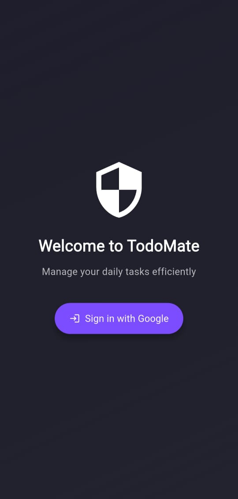
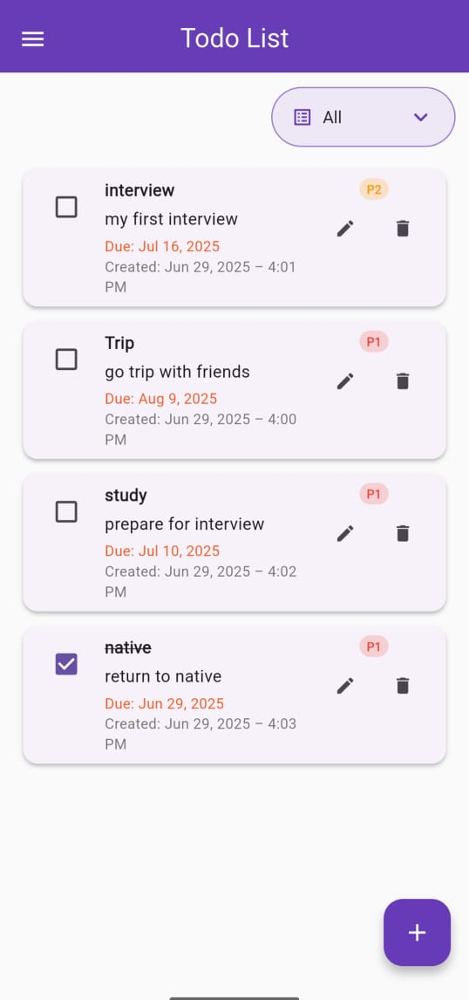
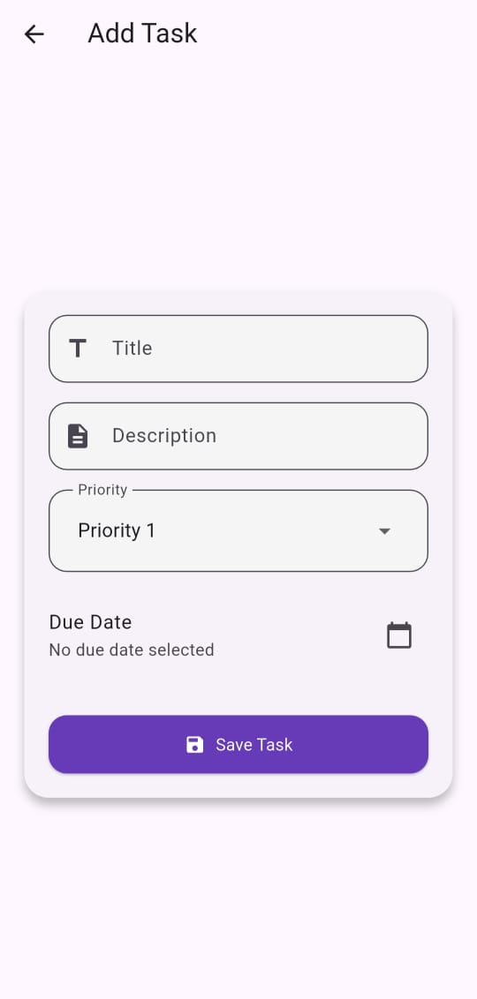
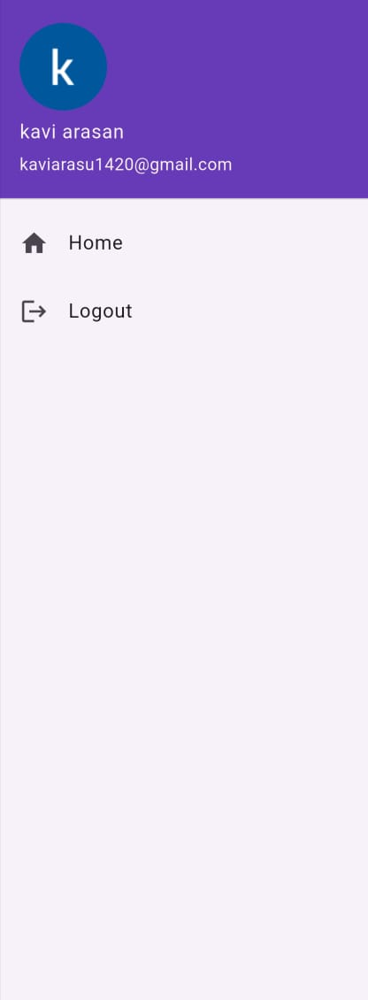

# Flutter Todo Task Management App 📝

A modern, cross-platform Todo Task Management Mobile Application built using **Flutter** with **Firebase** backend. The app enables users to sign in with google account, manage tasks with full CRUD functionality, filter/sort tasks, and enjoy a clean, responsive user interface with offline support.

---

## ✨ Features

- 🔐 Google login via Firebase Authentication
- 📝 Add, edit, delete tasks
- 🗂️ Filter tasks: All, Completed, Incomplete
- 🚦 Priority-based sorting (High to Low)
- 📅 Due date for task
- ✅ Swipe to mark task as complete/incomplete
- 📶 Offline caching (Instant load and access)
- 🔄 Pull-to-refresh for manual sync
- 🎨 Clean and responsive UI with subtle animations

---

## 📱 Screenshots

| Login Page | Homepage | Task Form |  Nav Bar | Filter Dropdown |
|------------|----------|-----------|----------|-----------------|
|  |  |  |  |  |

---

## 🏗️ Architecture

The app follows the **MVVM (Model-View-ViewModel)** pattern using **Provider** for state management.

---

🎥 [Watch Demo Video](https://drive.google.com/file/d/1WBx8D_JDeybCx9xI2OjJ1qo22Ih3Z7E0/view?usp=drivesdk)
In the video, I explain the structure, features, and working of the app.

---
